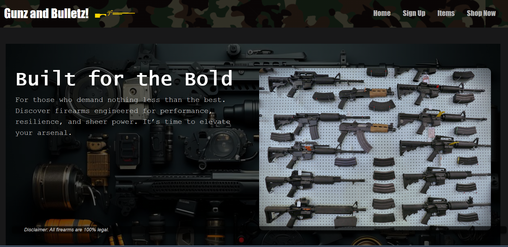
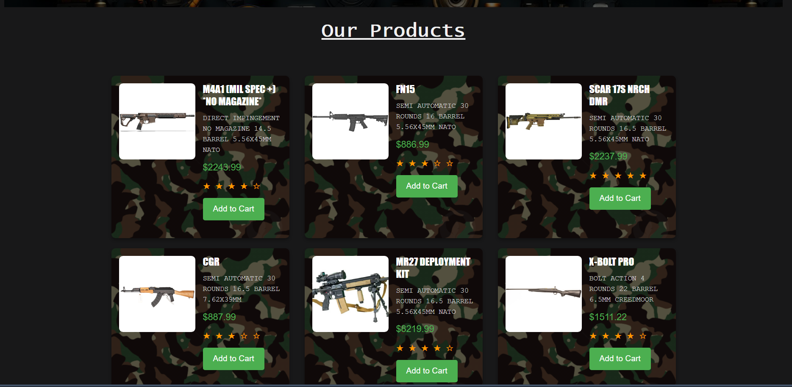
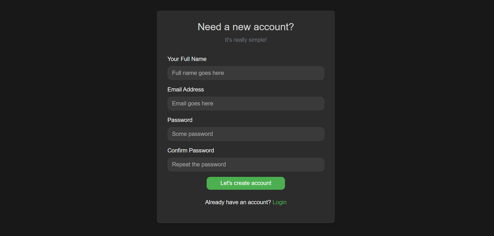

# Ecommerce Website

This project demonstrates a simple, static e-commerce website built using HTML, CSS, and Bootstrap. It includes a landing page and a signup page. The website provides users with a basic interface to explore products and sign up for the platform.

## Features

- **Responsive Design**: The website is fully responsive, ensuring a smooth experience on all device sizes.
- **Landing Page**: Displays a welcoming message, product highlights, and navigation to other sections.
- **Signup Page**: Allows users to register for the site by entering basic personal information.

## Technologies Used

- **HTML**: Markup language used to structure the website's content.
- **CSS**: Styling applied to the website for layout, fonts, colors, and more.
- **Bootstrap**: A front-end framework used to speed up development with pre-built components and grid layout.

## Pages

- **Landing Page (`Assignment1.html`)**: The homepage of the site, providing details on featured products, special offers, and a call to action for users to sign up.
- **Signup Page (`Assignment2.html`)**: A form where users can create an account to gain access to further features of the website.

## Screenshots

### Landing Page

### Signup Page

